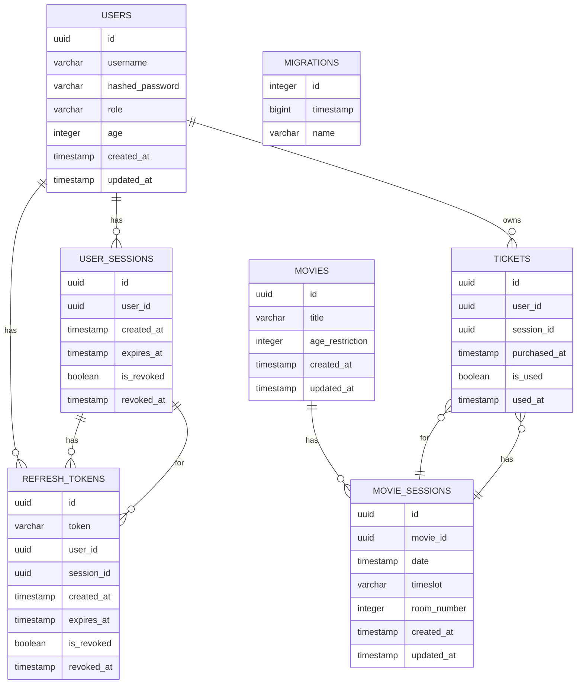

# Design Document for Movie Management API

This is a Movie Management System created using Node.js and the NestJS framework. It is a RESTful API that allows management of authentication, users, movies, movie sessions, tickets, and viewing history. The application is designed with Domain-Driven Design (DDD) principles in mind, ensuring a modular and maintainable codebase.

## Glossary

Basic terms used throughout the document:

- **Manager**  
  A user role with permissions to manage movies, movie sessions, and tickets.
- **Customer**  
  A user role with permissions to view movies and purchase tickets.
- **Movie**  
  An entity representing a film with attributes like name and age restriction.
- **Movie Session**  
  An entity representing a specific screening of a movie, including date, timeslot, and room number.
- **Ticket**  
  An entity representing a purchased ticket for a movie session, linked to a user.
- **Watch History / Used Tickets**  
  A record of movies watched by a customer, derived from their purchased tickets.
- **JWT (JSON Web Token)**  
  A compact, URL-safe means of representing claims to be transferred between two parties, used for authentication.
- **DTO (Data Transfer Object)**  
  An object that carries data between processes, used to encapsulate request and response data.
- **ER Diagram (Entity-Relationship Diagram)**  
  A visual representation of the database schema, showing entities and their relationships.

## Goals

- Provide a secure authentication system with JWT tokens and role-based access control.
- Allow managers to create, update, and delete movies and their sessions.
- Enable customers to buy tickets for movie sessions and view their watch history.
- Implement caching for frequently accessed bulk data to improve performance.

## Requirements

## Non-Functional Requirements

- **Performance**  
  API should respond to standard requests within 500ms under normal load.
- **Scalability**  
  The system should support adding more users, movies, and sessions without significant performance degradation.
- **Availability**  
  The API should be available 99.9% of the time.
- **Security**  
  All sensitive data (such as passwords) must be securely stored and transmitted. Only authorized users can access protected endpoints.
- **Maintainability**  
  The codebase should be modular and follow best practices to allow easy updates and feature additions.
- **Portability**  
  The application should run on any environment that supports Node.js v20+.

## Architecture Overview

### Layered Architecture

The application is structured into several layers to separate concerns and promote scalability. Each domain module follows this layered architecture:

1. **Presentation Layer**  
   Handles HTTP requests and responses. It includes controllers and DTOs for data validation.
2. **Application Layer**  
   Contains services that implement business use cases. It orchestrates domain logic and interacts with repositories.
3. **Domain Layer**  
   Encapsulates the core business logic, including entities, value objects, and repository interfaces.
4. **Infrastructure Layer**  
   Manages data persistence and external integrations. It includes concrete implementations of repositories and other infrastructure concerns.

### Modules

1. **Auth Module**
   - Register new users (customers or managers).
   - Login and issue JWT tokens.
   - Refresh and revoke tokens.
   - Logout and invalidate sessions.
   - Role-based access control guards (manager vs customer).
   - User session management for future to collect active session data.

2. **User Module**
   - Retrieve all users or a specific user by ID.
   - Retrieve tickets for a specific user.

3. **Movie Module**
   - Managers can create, update, delete movies.
   - Bulk add/delete movies.
   - Retrieve movies and their sessions.
   - Movies include name, age restriction, and sessions.
   - Managers can create sessions for movies.
   - Sessions include date, timeslot, and room number.
   - Prevent double-booking of rooms.
   - Bulk session creation/deletion.

4. **Ticket Module**
   - Customers can buy tickets for movie sessions.
   - Tickets link a user to a movie session.
   - Managers can mark tickets as used.
   - Managers can delete tickets.
   - Tickets can be listed globally (manager view) or per user.
   - Customers can view their own watch history.
   - Managers can view tickets of any user.

5. **Health Module**
   - Provides a health check endpoint to monitor application status.

## Technologies

- Node.js (v20 or later)
- NestJS framework
- TypeScript
- SQLite (initial MVP) / PostgreSQL (for later, deployment costs?)
- TypeORM
- JWT with role-based guards
- Validation with `class-validator` decorators
- API documentation with Swagger (`@nestjs/swagger`)

## Security

- Passwords hashed with bcrypt.
- JWT tokens for stateless authentication.
- Role-based access control:
  - **Managers:**  
    Manage movies, movie sessions, mark tickets as used, view all tickets.
  - **Customers:**  
    Buy/cancel tickets, view own tickets, watch movies.
- Input validation enforced at DTO level.
- Guards ensure only authorized roles access protected endpoints.

## API Versioning

- All endpoints are prefixed with the API version (e.g., `/v1`).
- Initial version is `/v1` on deployment.

## Endpoints

Endpoints are marked with their required roles (manager or customer).

**API**

- `GET /` should return application info, version, docs link.

**Auth**

- `POST /v1/auth/register` should register new user, returning access and refresh tokens
- `POST /v1/auth/login` should login user, returning access and refresh tokens
- `POST /v1/auth/refresh` should refresh access token via refresh token
- `POST /v1/auth/logout` should logout user, invalidating all tokens for the user

**Users**

- `GET /v1/users` should get all users (manager only)
- `GET /v1/users/{userId}` should get user by ID (manager only)
- `GET /v1/users/{userId}/tickets` should get tickets for a specific user (manager only)

**Tickets**

- `GET /v1/tickets` should get all tickets (manager only)
- `POST /v1/tickets` should buy a ticket (customer)
- `GET /v1/tickets/me` should get logged-in user’s tickets, can be used as watch history (customer)
- `POST /v1/tickets/{ticketId}/use` should mark ticket as used (manager only)
- `DELETE /v1/tickets/{ticketId}` should cancel a ticket (manager only)

**Movies**

- `GET /v1/movies` should get all movies (customer)
- `POST /v1/movies` should create a movie (manager only)
- `GET /v1/movies/{movieId}` should get movie by ID (customer)
- `PATCH /v1/movies/{movieId}` should update a movie (manager only)
- `DELETE /v1/movies/{movieId}` should delete a movie (manager only)
- `POST /v1/movies/bulk` should bulk create movies (manager only)
- `DELETE /v1/movies/bulk` should bulk delete movies (manager only)
- `GET /v1/movies/{movieId}/sessions` should get movie sessions for a movie (customer)
- `POST /v1/movies/{movieId}/sessions` should create movie session for a movie (manager only)
- `POST /v1/movies/{movieId}/sessions/bulk` should bulk create movie sessions (manager only)
- `GET /v1/movies/{movieId}/sessions/{sessionId}` should get movie session by ID (customer)

**Movie Sessions**

- `GET /v1/movie-sessions` should get all movie sessions (customer)
- `DELETE /v1/movie-sessions/{sessionId}` should delete movie session (manager only)
- `DELETE /v1/movie-sessions/bulk` should bulk delete movie sessions (manager only)

**Health**

- `GET /v1/health` should return application health status

**Swagger Documentation UI**

- `GET /v1/api` should serve Swagger UI for API documentation
- `GET /v1/api-json` should serve OpenAPI spec in JSON format

## DTO and Entity Design

- **Auth DTOs** include `RegisterDto`, `LoginDto`, `RefreshTokenDto`, `AuthResponseDto`
- **User DTOs** include `UserResponseDto`
- **Movie DTOs** include `CreateMovieDto`, `UpdateMovieDto`, `DeleteMovieDto`, `QueryMovieDto`, `MovieResponseDto`
- **Movie Session DTOs** include `CreateMovieSessionDto`, `DeleteMovieSessionDto`, `QueryMovieSessionDto`, `MovieSessionResponseDto`
- **Ticket DTOs** include `BuyTicketDto`, `GetUserTicketsDto`, `TicketResponseDto`
- **Common DTOs** include `PaginationMetaDto`

Entities encapsulate business rules (e.g., `Ticket.markAsUsed()` enforces one-time use).

Refined entity definitions are given below in the ER diagam section.

## Configuration

- Environment variables managed via `.env` files.
- Configuration includes database connection, JWT settings, logging options.

## Caching

- In-memory caching is implemented for GET endpoints in the Movie module.
- Cache invalidation is triggered by movie or movie session mutations.
- Cache middleware intercepts GET requests and serves cached responses when available.
- The caching system should be extensible to other modules in the future, supporting multiple, independent caching strategies.

## Error Handling

- Global error handling with NestJS exception filters.
- Custom exceptions for domain-specific errors (e.g., `MovieNotFoundException`) extend the base NestJS exceptions.
- Example error response:
  ```json
  {
    "statusCode": 404,
    "error": "Not Found",
    "message": "Movie not found"
  }
  ```

## Trace Logging

- Trace logs can be enabled or disabled using the `Trace Logs` and `Cache Trace Logs` environment variables.
- Trace middleware adds unique trace IDs to requests for easier debugging.
- `Trace Logs` should record response errors and important events.
- `Cache Trace Logs` should log cache hits for the relevant cache key.
- The trace logging system should be easily exposable to external monitoring systems in the future.

## Documentation

- Controllers use Swagger decorators (`@ApiTags`, `@ApiResponse`).
- OpenAPI spec is available (preferably) at `/api`.

## Testing

- Unit tests for services.
- End-to-end tests for controllers.
- Coverage includes authentication, movie/movie session management, ticket workflows.
- Setup includes nestjs testing utilities and separate test database.

## Deployment

- Hosted on GitHub with CI/CD pipeline.
- Test stage runs on pull requests and merges to main branch.
- Deployment stage run on merges to main branch.
- Automatic deployment to Heroku or similar cloud platform. For cost reasons, maybe use an existing DigitalOcean droplet.
- Environment variables are supplied via OS environment or `.env` files.

## Out of Scope

- **Payment Processing**:  
  Integration with payment gateways or handling of financial transactions are not included.
- **Status Monitoring Services**:  
  External status monitoring and alerting services are not included.

## Appendix 1: ER Diagram

Below is refined version exported from the database schema used in the application.


